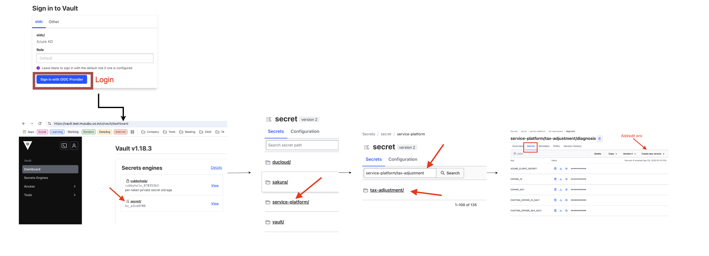

# TAX Infrastructure

## Service Platform Migration

- https://tax-adjustment.test.mfw.work/
- diagnosis: https://tax-adjustment-diagnosis.test.musubu.co.in
   - MFID_CLIENT_ID=qCyHw_hkUPtaetKJYerfVuhNjzZ9R_vJrmFByye6teo

### setup accesss bastion
Tade/phan.minh.trung - Wednesday at 16:38 - @Jeff - setup cái này nha

```
Host tax-adjustment-bastion
    StrictHostKeyChecking no
    UserKnownHostsFile=/dev/null
    IdentityFile ~/.ssh/id_ed25519
    HostName  nlb1.bastion.test.musubu.co.in
    Port 1133
```

```
ssh nguyen.tan.binh@tax-adjustment-bastion
```

### access to mysql workbench:

```
test-ta-rds-20250219080941889600000007.cluster-cwujgsutr2sa.ap-northeast-1.rds.amazonaws.com
root
dummydummydummydummy
database name: tax_adjustment_web_staging
```


Jeff - Wednesday at 16:54 - @Tade/phan.minh.trung - Có 1 cái console thì làm sao sài được cho cả diagnosis và stg anh?
Tade/phan.minh.trung - Wednesday at 16:54 - tìm cái web-diagnosis


Jeff - Yesterday at 11:12 - Con bastion để thao tác sql, mongo, hay redis thôi nha anh. Còn muốn chạy rails c thì vào trực tiếp pod trên argocd chạy

https://argocd.test.musubu.co.in/applications/stg-tax-adjustment

Jeff - Yesterday at 11:31 - @Nas/dam.phu.duong - @Reacher/tran.​ngoc.​hai

- Staging: tax-adjustment-web-console-0
- Diagnosis:
   - All Pods `tax-adjustment-web-diagnosis-xxx` can access the console
   
   - EX: diagnosis
   
   
 
- Vault
   - Link: https://vault.test.musubu.co.in/
   - 
 
## AWS Infrastructure


- The infrastructure diagram shows a comprehensive AWS-based architecture with a CI/CD pipeline. Key components as the following:

The core of your application runs in AWS with the following components:

1. **Networking**:
   - VPC (Virtual Private Cloud) with multiple subnets (public 1-3, private, database)
   - Internet Gateway for external connectivity
   - NAT Gateways in each public subnet to allow private resources to access the internet

2. **Compute**:
   - ECS (Elastic Container Service) for running containerized applications
   - EC2 instances in an Auto Scaling Group
   - Fargate containers for serverless container execution
   - ECS Service configuration with Task Definition, Desired Count, and Cluster settings

3. **Load Balancing**:
   - ALB (Application Load Balancer) distributing traffic to your application containers

4. **Storage and Database**:
   - RDS Primary Instance for your main database
   - Aurora Replica for database replication
   - S3 for static resource storage

5. **Caching and Search**:
   - Redis with Master/Replica configuration across availability zones
   - Elastic Search for search functionality

6. **Security**:
   - Security Groups (SG) for each tier (bastion, public, private, database, redis)
   - AWS Certificate Manager for SSL/TLS certificates
   - KMS (Key Management Service) for encryption

7. **Content Delivery**:
   - CloudFront for CDN services

8. **Monitoring and Management**:
   - AWS System Manager
   - Connection Draining, Instance Registration, and Health Checks

## Deployment Process

The right side of the diagram shows your CI/CD pipeline:

1. Developers submit code to GitHub
2. GitHub triggers an auto-build in CircleCI
3. The deployment process includes:
   - Test phase
   - Publish phase
   - Deploy phase
   - Notification to Slack upon completion

4. Container images are:
   - Built and pushed to ECR (Elastic Container Registry)
   - Pulled by ECS for deployment

## High Availability and Fault Tolerance

The architecture spans multiple Availability Zones (AZ 1, 2, and 3) for high availability with:
- Replicated databases
- Distributed Redis caches
- Multiple NAT Gateways
- Auto-scaling capabilities

## Data Flow

1. User requests come through Route53 (DNS)
2. Traffic flows through CloudFront and the Internet Gateway
3. The ALB routes requests to appropriate containers
4. Application containers interact with databases, caches, and other services
5. Logs and metrics are pushed to Kinesis Firehose and Elastic Search

This architecture provides a robust, scalable, and highly available environment for your application with a modern CI/CD pipeline for continuous deployment.

# Appendix

## Subnet Structure in TAX VPC

TAX VPC is divided into several types of subnets across three Availability Zones (AZ 1, AZ 2, and AZ 3), creating a highly available and secure network architecture:

### Public Subnets (labeled "public 1", "public 2", "public 3")
- These are directly connected to the Internet Gateway
- Each public subnet is in a different Availability Zone for redundancy
- They contain:
  - NAT Gateways (one in each public subnet)
  - Application Load Balancer (ALB) endpoints
  - Public-facing components

### Private Subnets (labeled "SG private")
- Not directly accessible from the internet
- Traffic to/from the internet routes through NAT Gateways in the public subnets
- These contain:
  - ECS instances running your application containers
  - Fargate tasks
  - Auto-scaling group resources
  - Application logic and business tier components

### Database Subnets (labeled "SG database" and "database 1-3")
- Most isolated tier with no direct internet access
- Spans all three Availability Zones
- Contains:
  - RDS Primary Instance
  - Aurora Replica
  - Database resources with read/write capabilities
  - Asynchronous replication between database instances

### Redis Subnets (labeled "SG redis")
- Specialized private subnets for caching infrastructure
- Contains:
  - Redis Master in one AZ
  - Redis Replica in another AZ
  - Replication configured between Redis instances

## Subnet Security and Connectivity

- Each subnet type has its own Security Group (SG) controlling inbound/outbound traffic
- The "SG bastion" appears to control access to management instances
- Private subnets can access the internet via NAT Gateways in the public subnets
- Traffic flows between subnets follow the principle of least privilege:
  - Application tier can reach database tier
  - Database tier is not directly accessible from public subnets
  - Redis caching layer is accessible only from application tier

## Multi-AZ Design

TAX subnet architecture implements a multi-AZ design pattern where:
- Critical components are distributed across three Availability Zones (AZ 1, 2, and 3)
- Each subnet type exists in multiple AZs for high availability
- This design ensures that your application can survive the failure of an entire AZ

This subnet architecture follows AWS best practices by creating isolated network tiers with appropriate security controls while maintaining high availability through multi-AZ deployment.

## Subnets and Subnet Groups in AWS

### What is a Subnet?

A subnet is a segmented portion of a network (in this case, your VPC) with its own IP address range. Think of it as dividing a large network into smaller, more manageable sections.

#### Key Characteristics of Subnets:
- **IP Range**: Each subnet has a defined CIDR block (e.g., 10.0.1.0/24)
- **Availability Zone**: Each subnet exists in exactly one Availability Zone
- **Network Access Control**: Subnets can be public (with direct internet access) or private (isolated)
- **Routing**: Each subnet has an associated route table that controls traffic flow

#### In Your Architecture:
Your VPC contains multiple subnets of different types (public, private, database) spread across three Availability Zones, as shown in the diagram. Each serves a specific purpose in your infrastructure.

### What is a Subnet Group?

A subnet group is an AWS construct that groups together multiple subnets across different Availability Zones for specific AWS services. It's not a networking concept but rather an AWS service-specific configuration.

#### Key Points About Subnet Groups:
- **Service-Specific**: Used by services like RDS, ElastiCache, Redshift, and Neptune
- **Multi-AZ Support**: Allows a service to deploy across multiple Availability Zones
- **Failover Capability**: Enables automatic failover between Availability Zones
- **Resource Placement**: Tells AWS where to place service resources

#### In Your Architecture:
While not explicitly labeled as "subnet groups" in the diagram, you can see this concept in action with:

1. **Database Subnet Group**: The collection of database subnets across AZs where your RDS Primary and Aurora Replica are deployed
2. **Redis/ElastiCache Subnet Group**: The collection of subnets where your Redis Master and Replica are deployed

### Relationship Between Subnets and Subnet Groups

- **Subnets** are the actual network segments with IP ranges
- **Subnet Groups** are logical groupings of these subnets for specific AWS services
- You first create subnets, then organize them into subnet groups for services that require them

### Benefits of This Architecture

1. **High Availability**: Resources distributed across multiple AZs via subnet groups
2. **Security Isolation**: Different types of resources in different subnets with appropriate security groups
3. **Fault Tolerance**: If one AZ fails, resources in other AZs remain available
4. **Network Segmentation**: Clear separation between public-facing components, application logic, and data storage

This subnet architecture is a fundamental part of building a resilient and secure AWS infrastructure, as shown in your diagram.

## What is an Availability Zone (AZ)?

### Definition of an Availability Zone

An **Availability Zone (AZ)** is a distinct physical location within an AWS Region that consists of one or more discrete data centers with redundant power, networking, and connectivity.

Think of an AZ as an independent data center facility designed to be isolated from failures in other Availability Zones while still being in relatively close geographic proximity.

### Key Characteristics of Availability Zones

#### 1. Physical Isolation
- Each AZ is housed in separate facilities
- AZs within a region are typically several miles apart from each other
- They have independent power sources, cooling systems, and network connectivity
- Designed to be isolated from disasters affecting other zones

#### 2. Low-Latency Connectivity
- All AZs in a region are connected by high-bandwidth, low-latency networking
- Data transfer between AZs in the same region is fast but not instantaneous
- AWS charges for data transfer between AZs (though at a lower rate than cross-region)

#### 3. Naming Convention
- AZs are identified by a letter appended to the region code (e.g., us-east-1a, us-east-1b)
- The mapping of these identifiers to physical locations is account-specific for load balancing

### How AZs Appear in Your Architecture

In your infrastructure diagram:
- You have resources deployed across three AZs (labeled as "AZ 1", "AZ 2", and "AZ 3")
- Each AZ contains the same types of subnets (public, private, database, etc.)
- Critical components like databases and Redis are replicated across AZs

### Benefits of Using Multiple AZs

#### 1. High Availability
- If one AZ experiences an outage, your application continues running in other AZs
- AWS's SLA guarantees are higher for multi-AZ deployments

#### 2. Fault Isolation
- Problems in one physical facility won't affect others
- Electrical issues, cooling problems, or natural disasters typically affect only one AZ

#### 3. Disaster Recovery
- Data replication across AZs enables rapid recovery
- Automatic failover capabilities for services like RDS and ElastiCache

### AWS Services and AZ Deployment

Many AWS services leverage multiple AZs for resilience:
- **RDS Multi-AZ**: Automatic synchronous replication to a standby in another AZ
- **ELB/ALB**: Distributes traffic across instances in multiple AZs
- **Auto Scaling Groups**: Can balance instances across AZs
- **S3**: Automatically replicates data across multiple AZs within a region

In your architecture, you're following AWS best practices by deploying critical infrastructure components across all three AZs, creating a highly available and fault-tolerant system.

## NAT Gateway

A NAT Gateway (Network Address Translation Gateway) is a managed AWS service that allows instances in a private subnet to connect to the internet or other AWS services while preventing the internet from initiating connections to those instances.

Key aspects of NAT Gateways:

- **Purpose**: They enable outbound internet connectivity for resources in private subnets that don't have public IP addresses
  
- **Network Security**: They help maintain security by allowing outbound traffic while blocking unsolicited inbound traffic

- **High Availability**: They're deployed per Availability Zone for redundancy (as mentioned in your document: "We have NAT for 3 availability zones")

- **Managed Service**: AWS handles the maintenance, availability, and scaling of NAT Gateways

- **Cost**: They incur charges based on both hourly usage and data processing

- **Performance**: They can support up to 45 Gbps of bandwidth and automatically scale up to 100,000 simultaneous connections to a single destination

NAT Gateways are commonly used in multi-tier architectures where backend services need to access the internet (for updates, API calls to external services, etc.) but shouldn't be directly accessible from the internet themselves.

## Bastion Host

A Bastion Host is a secure and managed instance in a public subnet that allows secure remote access to resources in private subnets.

Key aspects of Bastion Hosts:

- **Purpose**: They provide a secure entry point for remote access to private resources

- **Security**: They enforce strict access controls and provide a secure channel for remote management

- **Managed Service**: AWS handles the maintenance, availability, and scaling of Bastion Hosts

- **Cost**: They incur charges based on both hourly usage and data processing

- **Performance**: They can support up to 45 Gbps of bandwidth and automatically scale up to 100,000 simultaneous connections to a single destination

Bastion Hosts are commonly used in multi-tier architectures where backend services need to access the internet (for updates, API calls to external services, etc.) but shouldn't be directly accessible from the internet themselves.

## PWS (Personal Web Server)

PWS is a scaled-down web server software for Windows operating systems. It's used to join MFJ network before accessing the Bastion host.

## SSH/Tunnel

SSH/Tunnel is a secure remote access protocol that allows you to connect to a remote server using a secure channel.

