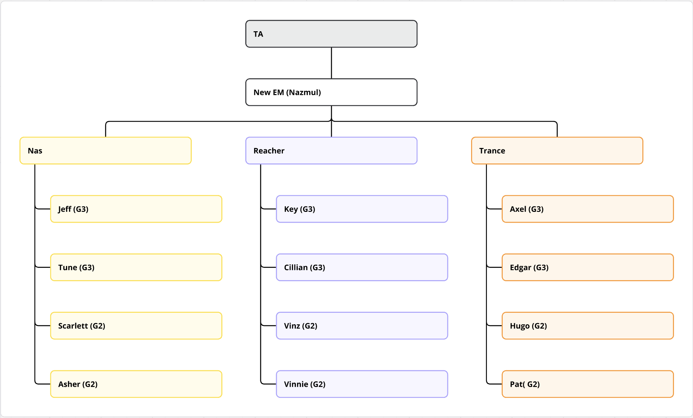

# TAX Onboarding Documents

## Accounts

### SRE
    - Github: Version control system: source code management and collaboration
        - Repo: https://github.com/moneyforward/tax_adjustment_web
    - Jira: Project management and issue tracking tool
    - Confluence: Knowledge base and documentation platform for team collaboration
    - Heroku: Cloud platform for app deployment and scaling
        - Request `#contact_cio_managed-tools` to get access to the moneyforwardvietnam team
        - Shared account: tran.kinh.ly+herokutateam@moneyforward.co.jp
    - CircleCI (CI/CD): Continuous integration and deployment platform for automated testing and deployment
    - Rollbar: Error monitoring and tracking tool for identifying and fixing application issues
    
### Company Tools
    - Slack: Team communication and collaboration tool
    - Kibela: Knowledge base and documentation platform for team collaboration
        - https://moneyforward.kibe.la/
        - MFV: https://moneyforward.kibe.la/groups/1454
    - Figma: Design tool, e.g. prototyping
    - Miro: Collaboration and communication tool for team collaboration
    - Google Accounts: Drive, Calendar, etc.
    - SonarQube: Code quality and security tool
        - Link: https://sonar.mfvn.dev/projects
        - Login with Github account
        - Request access: use this Slack channel #contact_cio_managed-tools
        - Request Users Access: use this Slack channel #sonarqube, fill in email, type: FREE, add and project: Tax Adjustment
        - Config VSCode IDE to connect SonarQube: 
            - Install VSCode extension: `SonarQube for IDE`
            - Generate user token
            - Connect to SonarQube server: `sonar.mfvn.dev`

### Communication
    - Frequent used Slack channels
        - #contact_cio_managed-tools
        - #contact_mfv-corp-it-support: IT support
        - #mfv_ta_onboard: TA VN Onboarding Team
        - #mfv_ta_random: TA VN Team - Random talks
        - #mfv_ta_vn: TA VN Team 
        - #mfv_ta_dev_vn: TA Dev VN Team (including former TA Devs)        
        - #ta_dev_all: クラウド年末調整の開発チームのチャンネル/ Cloud Tax Adjustment development team channel
        - #ta_design: TA Design Team (JP + VN)
        - #ta_core: TA Core Team
        - #ta_random            
        - #ae-ta-dev (private channel): TA Dev VN Team

## Team and Product

### Team structure

Manager: Nas
QA: Phoenix, Sasa, Higuma (outsourcing)
Accelerator: Luna, Gwen
Dev: Reacher, Hugo, Jeff, Key, Pat, Edgar, Asher, Vinnie, Scarlett, Axel

## Way of work

### Daily Standup

#### Daily Init (Chorei)
- Initiator: Are you ready? 
- Others: Yes/Yo
- Initiator: Let's make it.
- Everyone: Together

#### Code Convention
- [Code convention](https://moneyforwardvietnam.atlassian.net/wiki/spaces/TA/pages/1715634206/Code+convention)

#### Implementation Flow:

implement -> self test -> báo QA -> QA confirm passed -> review -> merge

#### Implementation Branches :

implement (feature/TAXW-<ticket-id>-<description>) -> self test (heroku/<branch-name>) -> notify QA (JIRA ticket) -> QA confirm passed -> review -> merge PR

#### Sprint: 

- 2 weeks
- Tasks in Sprint
- Releases in Sprint
- Sprint Review

**Example: TAX-111**

| Sprint Information | Link |
|-------------------|------|
| Sprint Period | [TAX-111 (Mar 03 - Mar 14)](https://moneyforwardvietnam.atlassian.net/wiki/spaces/TA/pages/2561147519/TAX-111+Mar+03+-+Mar+14) |
| Tasks in Sprint | [TAX-111 tasks](https://moneyforwardvietnam.atlassian.net/wiki/spaces/TA/pages/2561147540/TAX-111+tasks) |
| Sprint Review | [TAX-Sprint 110 Review](https://moneyforwardvietnam.atlassian.net/wiki/spaces/TA/pages/2561147675/TAX-Sprint+110+Review) |

**Releases in Sprint:**
- [Release on Mar 06, 2025](https://moneyforwardvietnam.atlassian.net/wiki/spaces/TA/pages/2561147623/Release+on+Mar+06+2025)
- [Release on Mar 13, 2025](https://moneyforwardvietnam.atlassian.net/wiki/spaces/TA/pages/2561147650/Release+on+Mar+13+2025)

#### Gitflow:

| Branch Type | Format | Example |
|-------------|--------|---------|
| Milestone | `milestone/<mm-dd>` | milestone/mar-13 |
| Feature | `[feature]/<JIRA-Ticket-ID>-<description>` | feature/TAXW-1324-disable-electric-submit |
| Development | `develop` | develop |
| QA | `heroku/<branch-name>` | heroku/dependabot |

#### Pull Request:

| Component | Format | Example/Details |
|-----------|--------|----------------|
| Title | `[JIRA_Ticket] Description` | [TAXW-1324] Disable "Electric Submit" |
| Description | Include evidence of self-testing | Screenshots or screencasts to provide evidence of the self-test from your side |
| Reviewer | Add team reviewer group | @ta_dev_mfv_reviewers |

### Product overview
PA: Payroll
TA: Tax Adjustment
SG: Support Group
MFID: Money Forward ID - openid connect
ERP: Employee Record Processing

#### Tax Adjustment Web

| Service | Environment | Link |
|---------|-------------|------|
| MFID | Staging | [Link](https://id.test.musubu.co.in/oauth/applications/260) |
| ERP | Staging | [Link](https://erp-stg1.ebisubook.com/home) |
| Payroll | Staging | [Link](https://payroll.ebisubook.co.in/) |
| Rollbar | - | [Link](https://app.rollbar.com/a/moneyforward/fix/items?isSnoozed=false&prj=486797) |
| CI/CD Pipeline | - | [Link](https://app.circleci.com/pipelines/github/moneyforward/tax_adjustment_web) |
| Heroku | Dependabot | [Link](https://dashboard.heroku.com/apps/tax-milestone-dependabot) |
| | web-dev | [Link](https://dashboard.heroku.com/apps/tax-adjustment-web-dev) |
| | next-release | [Link](https://dashboard.heroku.com/apps/tax-adjustment-web-dev) |

### Technical architect:

- Architecture overview, DDD

- Integration between FE & BE

- Gitflow

- Coding standard, quality standard(Unit test coverage

## Release Plan

### Project/Release Plan

## Documentation
- [Tech documents](https://moneyforwardvietnam.atlassian.net/wiki/spaces/TA/pages/1659600905/Tech+documents)
- [TA System Guidebook](https://moneyforwardvietnam.atlassian.net/wiki/spaces/TA/pages/1668513853/TA+System+guidebook)

## Installation

### SonarQube Extension in VSCode

1. Install the SonarQube Extension for IDE
    - Open VSCode
    - Go to Extensions (Cmd + Shift + X)
    - Search for SonarQube and click Install

2. Install Node.js v18.20.7
    - SonarQube requires Node.js v18.18+, so you need to install the correct version

3. Configure Node.js Path in SonarQube Settings
    - Run this command to get the path of the newly installed Node.js: npm config list
    - Copy the Node.js path (e.g., /Users/your-username/.nvm/versions/node/v18.20.7/bin/node)
    - Paste this path into SonarQube Extension settings in VSCode

4. Generate User Token on SonarQube
    - Go to https://sonar.mfvn.dev/account/security
    - Click Generate User Token
    - Name/Expires in: Set as you wish
    - Type: Select User Token
    - Copy the generated token for the next step

5. Set Up SonarQube Connection in VSCode
    - Open VSCode, press Cmd + Shift + P
    - Select Connect SonarQube Server
    - Enter the information from Step 4 (URL, Token)
    - Save the connection

6. Configure the Project
    - After setting up the connection, SonarQube Extension will display a popup to configure the project
Select tax_adjustment when prompted

## Appendix

### Slack channels by category:
    
    - External Connections:
        - #contact_cio_managed-tools
        - #contact_ciso_security
        
    - MFV Level (`#mfv_xxx`):
        - IT support: #contact_mfv-corp-it-support
        - #mfv_ta_onboard: TA VN Onboarding Team
        - #mfv_ta_random: TA VN Team - Random talks
        - #mfv_ta_vn: TA VN Team 
        - #mfv_ta_dev_vn: TA Dev VN Team (including former TA Devs)
        - #mfv-absence-notification
        - #mfv-announcement
        - #mfv-base-timesheet-notify
        - #mfv-corporate-incident-announcement
        - #mfv-hcm-football-club
        - #mfv-random-hcmc
        - #mfv-welcome-onboard
        - #mfv_hcm-ruby
        - #mfv-forwardian-radio
        
    - Corp. Level (`#mfw_xxx`):
        - #mfw_action-required
        - #mfw_announcement
        - #mfw_events
        - #mfw_critical_incident_announcement
        - #mfg_action-required
        - #mfg_announcement
        - #mfg_events
        - #mfg_pr
        
    - TA Level (`#ta_xxx`):
        - #ta_dev_all: クラウド年末調整の開発チームのチャンネル/ Cloud Tax Adjustment development team channel
        - #ta_dev_aweb_notification_[production/staging]
        - #ta_dev_[production/staging_billings]_report
        - #ta_monitoring_[production/staging]
        - #ta_design: TA Design Team (JP + VN)
        
    - Incident & Monitoring:
        - #incident_tracking
        - #msb_info
        
    - Other:
        - #cursor-ai
        - #hcm-ruby
        - #mf_orientation_new_entry_training
        - #ae-ta-dev (private channel): TA Dev VN Team