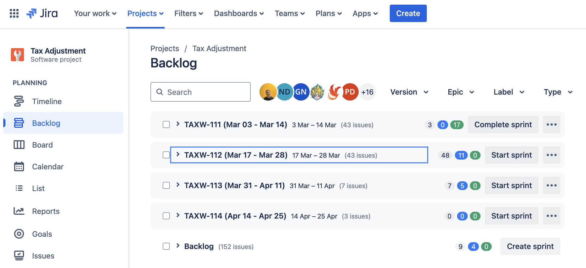

# TAX Onboarding Documents

## Accounts

### SRE and Company Tools
*Notes: Request via #contact_cio_managed-tools*

- **Github**: Version control system: source code management and collaboration
    - Repo: https://github.com/moneyforward/tax_adjustment_web
- **Jira**: Project management and issue tracking 
    - Change Fullname Request Channel: #contact_mfv-corp-it-support
        - Change Fullname to `<nickname> (<real name>)`
- **Confluence**: Knowledge base and documentation platform
    - Request channel: #contact_mfv-corp-it-support
- **IDEs and Development Tools**
    - JetBrain/VSCode/Cursor
    - Cursor: [License registration link](https://cursor.com/team/accept-invite?code=084223bacfee104259a2067c1dbb0f386ab7ce533d83daeb)
- **Heroku**: Cloud platform for app deployment and scaling
    - User: `TA Team`
    - Team: `moneyforwardvietnam`
- **CircleCI**: Continuous integration and deployment platform
    - Organization `moneyforward`
- **Rollbar**: Error monitoring and tracking tool
    - Login with Google account
    - Project: `tax_adjustment`
- **Slack**: Team communication and collaboration tool ✅
    - Change display name to `<nickname>` or `<nickname> (<real/email name>)`
- **Kibela**: Knowledge base and documentation platform ✅
    - https://moneyforward.kibe.la/
    - MFV: https://moneyforward.kibe.la/groups/1454
- **Figma**: Design tool
- **Miro**: Collaboration tool
- **Google Accounts**: Docs, spreadsheets, presentations, Drive, Calendar, etc.
    - Change display name to `<nickname> MFV`
- **Zoom**: Video conferencing
    - Change display name to `<nickname> MFV`
- **SonarQube**: Code quality and security tool
    - Link: https://sonar.mfvn.dev/projects
    - Login with Github account
    - Project: `tax_adjustment_web`
- **Datadog**: Monitoring platform
    - Organization: `Money Forward, Inc.`
    - Board: Tax Adjustment (All in One)
- **GlobalProtect**: VPN tool
    - Enable to connect to the company resources
- **Kollabe**: Agile Planning Poker
- **TestRail**:
    - Link: https://moneyforward.tmxtestrail.com

## Communication
  - TA VN
    - Team (all members): #mfv_ta_vn
    - Devs (all devs): #mfv_ta_dev_vn
    - Devs (internal): #ae-ta-dev
    - Onboarding Team: #mfv_ta_onboard
    - Random talks: #mfv_ta_random

  - Cloud Tax Adjustment
    - #ta_dev_all: Cloud Tax Adjustment development team channel
    - #ta_design: TA Design Team (JP + VN)
    - #ta_core: TA Core Team
    - #ta_random: Random talks
  
  - IT support: 
    - #contact_cio_managed-tools 
    - #contact_mfv-corp-it-support

## Team structure

[Team Members](https://moneyforwardvietnam.atlassian.net/wiki/spaces/TA/pages/1749319707/Release+Planning+and+Tracking#Team-Members)

- Division Manager: Nazmul-san
- LPdM: Saito-san
- Designer: Rachel-san
- Leader: Nas
- QAs: Phoenix, Sasa, Higuma (outsourcing)
- Accelerators: Luna, Gwen
- Devs: Reacher, Hugo, Jeff, Key, Pat, Edgar, Asher, Vinnie, Scarlett, Axel

**New Team structure (planned to apply on early April 2025)**


## Daily Meeting

**Structure:**
- Host: Mr. Reacher/Mr. Nas
- Guests: team TA, Nazmul-san and Saito-san
- Language: English (Vnese sometimes :face_with_hand_over_mouth:)
	
	*Note:*
	- **Nazmul-san**: Division Manager in MFJ, manages teams TA, SI, AT
	- **Saito-san (Yoko)**: LPdM in MFJ, handling business, communications with teams CS, Sale, Biz, Strategy....

**End of Meeting**: The team has a special closing ritual

```
- Initiator: Are you ready? 
- Everyone: Yes/Yo
- Initiator: Let's make it.
- Everyone: Together
```

**Example** [TA2024 Daily](https://docs.google.com/document/d/1BTKD6_zrRXJRBtBLq0Wf2E7KVlDDRruT_nId0Y3Rdw8/edit?tab=t.0)
```
- <Name>
	- Last day (Yesterday)
		- Meeting: <list here>
		- Tasks/Tickets: <Ticket + status list here>
	- Today
		- Meeting: 
		- Tasks/Tickets:

* Notes: No blockers listed, blockers will be discussed among the team in separated conversations
```

## Sprint

**Scrum** 
- Partial implementation

**Scrum Team**: 
- Devs + QAs

**Timeline**: 2 weeks
- Sprint Planning: Monday
- Sprint Review: Thursday
- Sprint Retrospective: Friday
- Release: Weekly

---
Example: 
- Sprint: [TAX-112 (Mar-17 - Mar-28)](https://moneyforwardvietnam.atlassian.net/wiki/spaces/TA/pages/2589786133/TAX-112+Mar+17+-+Mar+28)
	- [Sprint Planning (Mar-17 - Mar-28)](https://moneyforwardvietnam.atlassian.net/wiki/spaces/TA/pages/2589786133/TAX-112+Mar+17+-+Mar+28)
		- [Tasks in TAX-Sprint 112](https://moneyforwardvietnam.atlassian.net/wiki/spaces/TA/pages/2589786155/TAX-112+tasks)

	- Releases in Sprint:
		1. [Release on Mar 20, 2025](https://moneyforwardvietnam.atlassian.net/wiki/spaces/TA/pages/2589786238/Release+on+Mar+20+2025)
			- [Release Checklist (Mar 20, 2025)](https://moneyforwardvietnam.atlassian.net/wiki/spaces/TA/pages/2589786261/Release+Checklist+-+Mar+20+2025)
		2. [Release on Mar 27, 2025](https://moneyforwardvietnam.atlassian.net/wiki/spaces/TA/pages/2589786282/Release+on+Mar+27+2025)
			- [Release Checklist (Mar 27, 2025)](https://moneyforwardvietnam.atlassian.net/wiki/spaces/TA/pages/2589786311/Release+Checklist+-+Mar+27+2025)

	- Sprint Review:
		- [TAX-Sprint 112 Review](https://moneyforwardvietnam.atlassian.net/wiki/spaces/TA/pages/2589786340/TAX-Sprint+112+Review)

	- [Overall Timeline](https://moneyforward.atlassian.net/jira/software/projects/TAXW/boards/836/timeline)

*Example: [JIRA - Sprint Planning Structure](../assets/images/tax-sprint-planning.png)*

## Coding Convention
- [Coding convention](https://moneyforwardvietnam.atlassian.net/wiki/spaces/TA/pages/1715634206/Code+convention)

## Workflow

### Implementation Workflow

```
implement -> self test -> notify QA in JIRA ticket -> QA confirm passed -> review -> merge
```

Example with dev branches :

```
implement (feature/TAXW-<ticket-id>-<description>) -> self test (heroku/<branch-name>) -> notify QA (JIRA ticket) -> QA confirm passed -> review -> merge PR
```

### Gitflow

* **Branch Types:**
  * Milestone: `milestone/<mm-dd>` 
		- Example: `milestone/mar-13`
  * Feature: `[feature]/<JIRA-Ticket-ID>-<description>` 
		- Example: `feature/TAXW-1324-disable-electric-submit`
  * Development: `develop`
  * QA: `heroku/<branch-name>` 
		1. `heroku/dependabot_deployment`
		2. `heroku/web_dev_deployment`
		3. `heroku/next_releases`

### Pull Request Workflow
[Details from Reacher's messages](https://moneyforward.slack.com/archives/C08DTPV33M2/p1741750961563679)

- Basically, assign all devs as reviewers

**Pull Requests**

1. PR from *Task Branch* to *Milestones Branch* OR directly from *Task Branch* to *Release Branch* (for smaller tasks)
    - Assign devs made commits to the *Task Branch* as reviewers

where, 
- Task Branch: feature/<JIRA-Ticket-ID>-<description>
- Milestones Branch: milestone/<mm-dd>
- Release Branch: develop

Refer conversation: https://moneyforward.slack.com/archives/C07D8EDBQ6S/p1741747181259769
Example PR: https://github.com/moneyforward/tax_adjustment_web/pull/10647

2. PR from *Milestones Branch* to *Release Branch*
    - Assgin all devs

Refer conversation: https://moneyforward.slack.com/archives/C07D8EDBQ6S/p1741748295200559
Example PR: https://github.com/moneyforward/tax_adjustment_web/pull/10692

3. Sonar
- C0 >= 96.2
- C1 >= 82.5
- Tech debt >= 294 

**Pull Request**

* **Title**
  * Format: `[JIRA_Ticket] Description`
  * Example: `[TAXW-1324] Disable "Electric Submit"`

* **Description**
  * Include evidence of self-testing
  * Screenshots or screencasts to provide evidence of the self-test from your side

* **Reviewer**
  * Add team reviewer group
  * Example: `@ta_dev_mfv_reviewers`


### Impact Analysis Workflow

[Workflow](https://miro.com/app/board/uXjVIasAcJg=/)

1. Before implementation: 
    - Initiate the impact analysis document (along with Technical Document) and store in team's Drive:
        - In `Developement side`: https://drive.google.com/drive/u/0/folders/1BO8snrI4aT_gG5R9TXxOmv7uvHhtDvQ1
        - Add folder: `<JIRA-Ticket-ID>`, e.g. `TAXW-1324`
2. During implementation: 
    - Devs need to input updates to the impact analysis. 
    - QAs update changes to test scopes and test cases accordingly.
3. After implementation:
    - Devs need to finalize the impact analysis.
    - Attach the impact analysis document to the JIRA ticket and notify QAs.

**Who will review the impact analysis document?**
- Team lead
- Cross-review conducted by other team members

### Testing Workflow
TBD - To discuss with the QA team

### Smoke Test Workflow:

Branching strategy:
```
`origin/milestones/<mmm-dd>` -- merged to --> `origin/develop` -- merged to --> `origin/master` -- pushed to --> `origin/heroku/web_dev_deployment`
```

Notify QA to conduct smoke test on the `web-dev` environment before testing on `production`

### JIRA Ticket:

**Workflow**
    TO DO => IN PROGRESS => REVIEW (QA + PR) => DONE

**Structure**

    Epic
    ├── Story
    ├── Task
    │   └── Sub-task
    ├── Bug Report
    └── Internal Bug

**Backlog**



## Product

### Product overview

[Reference](https://docs.google.com/document/d/1OE3KmSQsdMsyfauXQzvZ0T1sIloy-bwNogLHuDkDOeE/edit?tab=t.0)

**Environments**

- Test environment
    - Heroku
        - Heroku web dev: https://tax-adjustment-web-dev.herokuapp.com/ 
        - Heroku dependabot: https://tax-milestone-dependabot.herokuapp.com
        - Heroku next release: https://tax-adjustment-next-release.herokuapp.com 

- Staging environment
    - Diagnosis: https://diagnosis.tax-adjustment.test.mfw.work 
    - Tax Adjustment: https://tax-adjustment.test.mfw.work 
    - Tax Adjustment Employee: https://tax-adjustment.test.mfw.work/my 
    - Tax Adjustment Aweb: https://tax-adjustment.test.mfw.work/aweb

- Production environment
    - Tax Adjustment: https://tax-adjustment.moneyforward.com/ 

**External services**

- MFID
    - Authentication service
    - [Staging - MFID Developer Console](https://id.test.musubu.co.in/oauth/applications)
- PA (Payroll)
    - https://payroll.ebisubook.co.in/ 
- Smart HR(Third party service)
    - https://smarthr.co.jp/en/ 
- Navis
    - https://biz-admin.test.mfw.work/ 
- My-number
    - https://mynumber.test.mfw.work  
    - Employee list: https://mynumber.test.mfw.work/employees
- SG (Support Group)
- ERP (Employee Record Processing)
    - https://erp-stg1.ebisubook.com/home

**Tax Adjustment Web**

| Service | Environment | Link |
|---------|-------------|------|
| Rollbar | - | [Link](https://app.rollbar.com/a/moneyforward/fix/items?isSnoozed=false&prj=486797) |
| CI/CD Pipeline | - | [Link](https://app.circleci.com/pipelines/github/moneyforward/tax_adjustment_web) |
| Heroku | Dependabot | [Link](https://dashboard.heroku.com/apps/tax-milestone-dependabot) |
| | web-dev | [Link](https://dashboard.heroku.com/apps/tax-adjustment-web-dev) |
| | next-release | [Link](https://dashboard.heroku.com/apps/tax-adjustment-web-dev) |

Ref: [Confluence](https://moneyforwardvietnam.atlassian.net/wiki/spaces/TA/pages/1634730702/Environments)

## Technical architect:

- Architecture overview, DDD

- Integration between FE & BE

- Gitflow

- Coding standard, quality standard(Unit test coverage

## Release Plan

### Project/Release Plan

## Documentation
- [Tech documents](https://moneyforwardvietnam.atlassian.net/wiki/spaces/TA/pages/1659600905/Tech+documents)
- [TA System Guidebook](https://moneyforwardvietnam.atlassian.net/wiki/spaces/TA/pages/1668513853/TA+System+guidebook)

## Installation

### SonarQube Extension in VSCode

1. Install the SonarQube Extension for IDE
    - Open VSCode
    - Go to Extensions (Cmd + Shift + X)
    - Search for SonarQube and click Install

2. Install Node.js v18.20.7
    - SonarQube requires Node.js v18.18+, so you need to install the correct version

3. Configure Node.js Path in SonarQube Settings
    - Run this command to get the path of the newly installed Node.js: npm config list
    - Copy the Node.js path (e.g., /Users/your-username/.nvm/versions/node/v18.20.7/bin/node)
    - Paste this path into SonarQube Extension settings in VSCode

4. Generate User Token on SonarQube
    - Go to https://sonar.mfvn.dev/account/security
    - Click Generate User Token
    - Name/Expires in: Set as you wish
    - Type: Select User Token
    - Copy the generated token for the next step

5. Set Up SonarQube Connection in VSCode
    - Open VSCode, press Cmd + Shift + P
    - Select Connect SonarQube Server
    - Enter the information from Step 4 (URL, Token)
    - Save the connection

6. Configure the Project
    - After setting up the connection, SonarQube Extension will display a popup to configure the project
Select tax_adjustment when prompted

## Appendix

### Slack channels by category:
    
    - External Connections:
        - #contact_cio_managed-tools
        - #contact_ciso_security
        
    - MFV Level (`#mfv_xxx`):
        - IT support: #contact_mfv-corp-it-support
        - #mfv_ta_onboard: TA VN Onboarding Team
        - #mfv_ta_random: TA VN Team - Random talks
        - #mfv_ta_vn: TA VN Team 
        - #mfv_ta_dev_vn: TA Dev VN Team (including former TA Devs)
        - #mfv-absence-notification
        - #mfv-announcement
        - #mfv-base-timesheet-notify
        - #mfv-corporate-incident-announcement
        - #mfv-hcm-football-club
        - #mfv-random-hcmc
        - #mfv-welcome-onboard
        - #mfv_hcm-ruby
        - #mfv-forwardian-radio
        
    - Corp. Level (`#mfw_xxx`):
        - #mfw_action-required
        - #mfw_announcement
        - #mfw_events
        - #mfw_critical_incident_announcement
        - #mfg_action-required
        - #mfg_announcement
        - #mfg_events
        - #mfg_pr
        
    - TA Level (`#ta_xxx`):
        - #ta_dev_all: クラウド年末調整の開発チームのチャンネル/ Cloud Tax Adjustment development team channel
        - #ta_dev_aweb_notification_[production/staging]
        - #ta_dev_[production/staging_billings]_report
        - #ta_monitoring_[production/staging]
        - #ta_design: TA Design Team (JP + VN)
        
    - Incident & Monitoring:
        - #incident_tracking
        - #msb_info
        
    - Other:
        - #cursor-ai
        - #hcm-ruby
        - #mf_orientation_new_entry_training
        - #ae-ta-dev (private channel): TA Dev VN Team

### Onboarding Checklists:

**Account Access**
- [ ] **Github** - Repo: https://github.com/moneyforward/tax_adjustment_web
- [x] **Slack** - Change display name to `<nickname>`
- [ ] **IDEs** - JetBrain/VSCode/Cursor
- [ ] **Zoom** - Change display name to `<nickname> MFV`
- [x] **Kibela** - Access to knowledge base
- [ ] **Google Accounts** - Docs, spreadsheets, presentations, Drive, Calendar
- [ ] **Google Display Name** - Change to `<nickname> MFV`
- [ ] **JIRA** - Project management access
- [ ] **JIRA Fullname** - Change to `<nickname> (Original Fullname)`
- [ ] **Confluence** - Documentation platform access
- [ ] **Heroku** - Access to the `moneyforwardvietnam` team
- [ ] **CircleCI** - Access to organization `moneyforward`
- [ ] **Rollbar** - Access to `tax_adjustment`
- [ ] **Figma** - Design tool access
- [ ] **Miro** - Collaboration tool access
- [ ] **SonarQube** - Access to project `tax_adjustment_web`
- [ ] **Datadog** - Access to Tax Adjustment board
- [ ] **GlobalProtect** - VPN tool for company resource access

### 