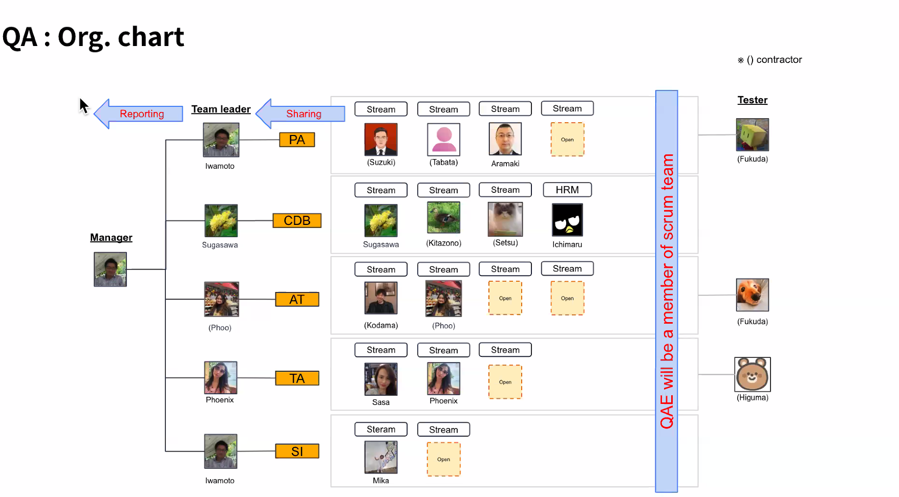

# TAX Daily Reports

## Daily Reports

### 2025-04-03
* Yesterday:
	- Meeting:
		- MFV Monthly All-Hands
		- [TA] Weekly Dev Sync
	- Tasks:
		- [TAXW-1555] The exported Payment report total PDF file is not matching with Calculation table
			- 
		- PR Reviews: 
			- [#10775](https://github.com/moneyforward/tax_adjustment_web/pull/10775): Update Installation guide (README)
			- [#10763](https://github.com/moneyforward/tax_adjustment_web/pull/10763): Update Docker setup for Dev Environment
* Today:
	- Release flow: 

### 2025-04-02
* Yesterday:
	- Meeting:
		- SG postpone release discussion
		- Bi-weekly MFG All-hands
		- [TA] Onboarding: Product Overview - Part 1
	- Tasks:
		- TAXW-1450: Fix My Number: Continue to fix the issue found during PR  Review
* Today:
	- Meeting:
		- MFV Monthly All-Hands
		- [TA] Weekly Dev Sync 
			- [Meeting Note](https://docs.google.com/document/d/1WURgPhtaHIm2BjvyzPJNDOLLHdgyN-1ytz1T1ChnCC0/edit?tab=t.0#heading=h.y0kd9gvtnh7q)
				- Notes
					- [[FY25 1H] DevProductivity Guild GGI](https://docs.google.com/document/d/1o_A_0LO8G5b8JEvDor4KTO7JrrVatQ4J5Uc5B4ZUU7E/edit?tab=t.0#heading=h.c893hcafsign)
					- [Lead time visualization：Project planning document](https://docs.google.com/document/d/1_sNZwbiYp81YRi1M0HwgxggXyPll5EcUNsVQI3J9gzc/edit?tab=t.0#heading=h.lhm2jbzd1g6i)
					- [Sample of lead time report](https://docs.google.com/spreadsheets/d/191KVbaxIiT63bk6oDZCTlhuVbrOyImCGSO3DhVKKYjk/edit?gid=2070628444#gid=2070628444)

					- Four keys related discussion
						```
						Nazmul / alam.nazmul
						13:25
						@Nas/dam.phu.duong

						I would like to know the progress of FindyTeam+
						We need to share the report using this template: official template.
						(I know Sato-san from #hrs_guild_devproductivity has requested or will request soon. He may share a different report file: https://docs.google.com/spreadsheets/d/1XEc6wZ_3XS-D9y5gDG38IERPaVXJaTPEgRvdJvFMjjQ/edit?gid=1874849089#gid=1874849089)
						You can see many report here: https://docs.google.com/spreadsheets/d/1drPtI-Mnq_rYfLy_HYSROY6A8OED5bxkh3B7k_Uez0M/edit?gid=0#gid=0 , mostly from SMB.
						Do we have enough data to prepare the report? Or, still we need something to do with setup?
						```

					- [Productivity Measurement management Sheet](https://docs.google.com/spreadsheets/d/1drPtI-Mnq_rYfLy_HYSROY6A8OED5bxkh3B7k_Uez0M/edit?gid=0#gid=0)
					- Steps
						- Have knowledge on [FindyTeam+ project](https://docs.google.com/document/d/17MszQgohmbawDL1iFehUjv_1NGLS2Rc717d9_mQtihw/edit?tab=t.qj9v92ih4743#heading=h.wuttopvlfuhn).
						- Select one or 2 capabilities.
				- TODO:
					- The first step is to read the "findee team plus document" to understand it.
					- The second step is to select one or two capabilities and add comments in column I of the document.
					- Instructions on how to configure Findi Team Plus are available in the document. Nas can assist with the configuration.
					- The process involves learning DORA capabilities, configuring Findi, and then collecting data. Data collection will be quarterly.
					- Nas offered to share relevant Findi documents with the team on Friday to help with understanding.
	- Tasks:
		- [TAXW-1555] The exported Payment report total PDF file is not matching with Calculation table
			- Starting with
		- PR Reviews: 
			- [#10775](https://github.com/moneyforward/tax_adjustment_web/pull/10775): Update Installation guide (README)
			- [#10763](https://github.com/moneyforward/tax_adjustment_web/pull/10763): Update Docker setup for Dev Environment

### 2025-04-01
* Yesterday:
	- Meeting:
		- [Garnet] Backlog Refinement
		- [TA Dev] Sprint Planning
		- [PRD sharing] issues list
		- [TA] Onboarding: Sharing Session 5
	- Tasks:
		- TAXW-1450 - Fix My Number: Investigated the issue found during PR  Review
		- PRs Review if time allows
* Today:
	- Meeting:
		- SG postpone release discussion
		- Bi-weekly MFG All-hands
		- [TA] Onboarding: Product Overview - Part 1
	- Tasks:
		- TAXW-1450: Fix My Number: Continue to fix the issue found during PR  Review
	- Review Pull Request (PR): 
		- reviewers: xxx_ta_dev -> garnet_ta_dev
		- reviewers: whole TA team - ta_dev_mfv_reviewers

### 2025-03-31
* Last Friday:
	- Meeting:
		- [TA] Onboarding: Sharing Session 4
		- [PRD sharing] issues list
		- [TA Dev] Team Sync-up
		- [TA] Dev & QA sync-up
		- TAX: Sprint Retrospective+ 2024 KPT review
		- [TA - Garnet team] Backlog Refinement
		- Tech seminar (Monthly)
	- Tasks:
		- Review PRs: improving SonarQube issues: TAXW-1547 to 1550 

* Last Friday:
	- Meeting:
		- [Garnet] Backlog Refinement
		- [TA Dev] Sprint Planning
			- [Sprint 113 - Tasks](https://moneyforwardvietnam.atlassian.net/wiki/spaces/TA/pages/2609742003/TAX-113+tasks)
		- [PRD sharing] issues list
		- [TA] Onboarding: Sharing Session 5
			- TA Workflows: JIRA ticket workflow and Implementation workflow
	- Tasks:
		- Review PRs: improving SonarQube issues: TAXW-1549, 1588
	- AI - Gemini: 
		- We can utilize Google Gemini to learn and research more about the Handbook document above.
		- Kibela Document: Customizing a Gemini Gem for the PVI Healthcare Insurance Handbook
		- Demo: https://drive.google.com/file/d/1ZOEQnENqIGhdxUScDh2EIT_y-dQ17xMU/view?usp=drive_link
	- Hugo: to review code and apply Presenter pattern as showcase to the team https://thoughtbot.com/blog/using-the-presenter-pattern-in-ruby-on-rails
	- Axl: how to request access to Aweb of TAX?
		- Nas: 
			- [Thread](https://moneyforward.slack.com/archives/C07KVUEGF3J/p1742348334027869?thread_ts=1742348334.027869&cid=C07KVUEGF3J)
			- Fai request 1 cái tren portal + aweb_tax-adjustment_stg_operator tren #contact_cio_managed-tools (e
### 2025-03-28

* Yesterday:
	- Meeting:
		- [TA] Onboarding: Sharing Session 3
		- TAX: Sprint Review
		- taxw_1467 incident review meeting
		- [MFV AI Community] Sharing session - DeepSeek
	- Tasks:
		- Review PRs: improving SonarQube issues: TAXW-1547 to 1550 
		- [TAXW-1502] [TAXW-1450] Fix empty string My Number
			- Following up with QA
- New members: 
		- Axel and Cillian were updating the Docker build for Dev 
		- Tune and Vinz were updating installation guide README
* Today:
	- Meeting:
		- [TA] Onboarding: Sharing Session 4
			- Sprint, and TA Lifecycle
		- [PRD sharing] issues list
		- [TA Dev] Team Sync-up
			- [TA2025] Bugs and Internal issues:
				- [Bugs](https://moneyforward.atlassian.net/browse/TAXW-1486)
				- [Internal issues](https://moneyforward.atlassian.net/browse/TAXW-29)
		- [TA] Dev & QA sync-up
		- TAX: Sprint Retrospective+ 2024 KPT review
			+ Tasks to assign:
				- [TAXW-1134](https://moneyforward.atlassian.net/browse/TAXW-1134): https://moneyforward.atlassian.net/browse/TAXW-1665
				- [TAXW-964](https://moneyforward.atlassian.net/browse/TAXW-964): https://moneyforward.atlassian.net/browse/TAXW-1668

		- [TA - Garnet team] Backlog Refinement
		- Tech seminar (Monthly)
	- Tasks:
		- Review PRs: improving SonarQube issues: TAXW-1547 to 1550 
	- New members: 
		- Axel and Cillian continue updating the Docker build for Dev 
		- Tune and Vinz continue updating installation guide README

### 2025-03-27
* Yesterday:
	- Meeting:
		- [TA] Onboarding: Sharing Session 2
		- Logical thinking & Documentation training #2
		- [Ask Me Anything】任意参加/voluntary participation
	- Tasks:
		- [TAXW-1502](https://moneyforward.atlassian.net/browse/TAXW-1502) [TAXW-1450] Fix empty string My Number
			- Fixed issue found
	- New members: 
		- Axel and Cillian are updating the Docker build for Dev 
		- Tune and Vinz are updating installation guide README
* Today:
	- Meeting:
		- [Sharing Session_PVI Healthcare Insurance 2025]
			- [Handbook](https://drive.google.com/file/d/1gSGBxOMuYKF2PxZcu-txUCOUMVCEm-pk/view)
		- TAX: Sprint Review
			- [Sprint-112](https://moneyforwardvietnam.atlassian.net/wiki/spaces/TA/pages/2589786340/TAX-Sprint+112+Review)
		- taxw_1467 incident review meeting
		- [TA] Onboarding: Sharing Session 3
			- Team Structure and Daily Meeting
			 - Pull Request
		- [MFV AI Community] Sharing session - DeepSeek
	- Tasks:
		- Review PRs: improving SonarQube issues: [TAXW-1547 to 1550 and 1558](https://github.com/moneyforward/tax_adjustment_web/pulls/phuocht-asher97)
		- [TAXW-1502](https://moneyforward.atlassian.net/browse/TAXW-1502) [TAXW-1450] Fix empty string My Number
			- Following up with QA and PR review
	- New members: 
		- Axel and Cillian continue updating the Docker build for Dev 
		- Tune and Vinz continue updating installation guide README
	- Phoenix: [Request Access to Aweb](https://moneyforwardvietnam.atlassian.net/wiki/spaces/TA/pages/2565832705/How+to+access+Aweb) for other apps: Navis, PA, SG, ERP


### 2025-03-26
* Yesterday:
	- Meeting: 
		- [TA] Onboarding: Sharing Session 1
		- MFBC Monthly All-hands video
	- Tasks:
		- [TAXW-1502](https://moneyforward.atlassian.net/browse/TAXW-1502) [TAXW-1450] Fix empty string My Number
			- Follow up with QA
* Today:
	- Meeting: 
		- [TA] Onboarding: Sharing Session 2
			- Setting up TAXW app and communication
		- Logical thinking & Documentation training #2
			- Yuki Mizutani: 
				- Anything but death is just a scratch. in JP: Nothing but death is a scratch
				- Be comfortable to "uncomfortable": Nothing is perfect and everything keeps changing, so I shall be able to feel comfortable to things/circumstances that normally make people feel uncomfortable.
			- Feedback survey
			- [Slides](https://docs.google.com/presentation/d/1LvR2zPvvLwwCVbmYNmcyUfdBL-tUxRkqD_KgQxOGdhM/edit#slide=id.g13012e9490d_0_0)
			- [Recording](https://drive.google.com/drive/folders/1WeAZIDEfQub7A8O3hSF2OheQF7JKrdgj)

		- [Ask Me Anything】任意参加/voluntary participation
	- Tasks:
		- [TAXW-1502] [TAXW-1450] Fix empty string My Number
			- Following up with QA and PR review
	- New joiners: will help to update Docker build for Dev and installation guide in README

### 2025-03-25
* Yesterday:
	- Meeting: 
		- 1:1 with Nas
	- Tasks:
		- [TAXW-1502](https://moneyforward.atlassian.net/browse/TAXW-1502) [TAXW-1450] Fix empty string My Number
			- Done Impact Analysis
* Today:
	- Meeting: 
		- [TA] Onboarding: Sharing Session 1
			- Account request and setup tools
		- MFBC Monthly All-hands video
	- Tasks:
		- [TAXW-1502](https://moneyforward.atlassian.net/browse/TAXW-1502) [TAXW-1450] Fix empty string My Number
			- Follow up with QA
	- [Review Workflow:](https://moneyforward.slack.com/archives/C08J7RL9CTT/p1742885107235459)
		- Ready for QA => Testing
		- if issue found: Testing => Implementing
		- if minor issue found: Testing (not impacted parts)
	- New joinner: some tasks
		- Axel and Vinz: will help to update the Docker build for TAXW
			- Questions: 
				- Dockerfile-dev: `RUN yarn install && RUN assets:precompile` => do we need to re-build the Docker image when updates to Stimulus controllers or CSSS?
				- Does production use Docker image? Should we use the Dockerfile to match with production environment? => to check with Nas/Reacher
				- `mysqldb` service: wait/read/write timeout? do we need extra-config for db?
				- update .gitignore to include .env.docker and .vscode and .cursor
				- Need a Jira ticket for this? No impact analysis and QA involvement needed
		- Tune and Cillian: will help to update the dev environment installation guide in README file
			- Question: Need a Jira ticket for this? No impact analysis and QA involvement needed?

### 2025-03-24
* Last Friday: 
	- Meeting: 
		- TA Management MTG
		- HR Solution Dept. Monthly AllHands
		- Bi-weekly TA and SRE team
		- [TA Dev] Team Sync-up
	- Tasks: 
		- [TAXW-1502](https://moneyforward.atlassian.net/browse/TAXW-1502) [TAXW-1450] Fix empty string My Number
			- To do Impact Analysis
		- [TAXW-1326](https://moneyforward.atlassian.net/browse/TAXW-1326) Export PDF
			- To do Impact Analysis
* Today:
	- Meeting: 
		- 1:1 with Nas
			- New Challenges for Team: Technical documentation, Impact analysis
			- Dev will execute test cases
				- Roadmap project:
					- Dev executes testing on Test environment
					- QA will test on Staging environment
				- Feedback/Improvement:
					- Dev executes testing on Test & Staging environment

	- Tasks:
		- [TAXW-1502](https://moneyforward.atlassian.net/browse/TAXW-1502) [TAXW-1450] Fix empty string My Number
	- Impact Analysis: 
		- [Guidelines and Template](https://docs.google.com/document/d/18Ne7nmBAoxdjdasnIifXa3U2CscT4C6YUntHq7w4-ck/edit?tab=t.m4doym6nuu9j#heading=h.ho9ao49zxkir)
		- [Team Drive](https://drive.google.com/drive/u/0/folders/1BO8snrI4aT_gG5R9TXxOmv7uvHhtDvQ1)
		- [Workflow](https://miro.com/app/board/uXjVIasAcJg=/)
		- [Reference from Asher](https://docs.google.com/document/d/1LwIvqstXuTOmvUSL1MjdNlccy4v5IZOq7jXbdcj7EOQ/edit?tab=t.0#heading=h.ufmkxd1r30zc)

### 2025-03-21
* Yesterday: 
	- Meeting: 
		- TA Incident Analysis - Final Result
	- Tasks: 
		- [TAXW-1502](https://moneyforward.atlassian.net/browse/TAXW-1502) [TAXW-1450] Fix search function based on whether My Number is registered or not
			- Fixed specs
	- Axel and Vinz are setting up TAXW environment
* Today: 
	- Meeting: 
		- [TA Management MTG](https://docs.google.com/document/d/1RD2GCG2ZdkFOVlNm8Fign_Lp0gAjLWKzt1CHMGrxF-w/edit?tab=t.0)
			- [Impact Analysis Workflow](https://docs.google.com/document/d/18Ne7nmBAoxdjdasnIifXa3U2CscT4C6YUntHq7w4-ck/edit?tab=t.m4doym6nuu9j)
			- [TA Team Org](https://docs.google.com/document/d/1W_vfGqB9dPSHBdkpPmjWKjt4uvHZf3DO860IC0uuBH4/edit?tab=t.0)
		- HR Solution Dept. Monthly AllHands
		- Bi-weekly TA and SRE team
		- [TA Dev] Team Sync-up
	- Tasks: 
		- [TAXW-1502](https://moneyforward.atlassian.net/browse/TAXW-1502) [TAXW-1450] Fix search function based on whether My Number is registered or not
			- To do Impact Analysis
	
	- Important Notice 
		- Yoko Saito: The following PRDs are ready for your review
			- [TA][PRD] Issue No.127 (changed the target end date from 14th)
			- [TA][PRD]Relationship Master Revision
			- Please review by COB 21th. Once you've finished your review, please comment that you've done so. Thanks!
		- Nas/dam.phu.duong: e đang arrange tasks của bug & internal bug....nên mọi người xem có cái nào để các bạn mới check or fix dc thì assign nha. Có thể từ dễ đến khó :smile:
			- https://moneyforward.atlassian.net/browse/TAXW-1486
			- https://moneyforward.atlassian.net/browse/TAXW-29
		- Reacher/tran.​ngoc.​hai: cái này là cái hwa Luna nó test ra trên prod
			- https://moneyforward.atlassian.net/browse/TAXW-300
		- [Offboarding Process](https://moneyforward.kibe.la/notes/318640):
		- [Important] Data Storage and Transfer Guidelines for Offboarding Employees
			- Hi everyone,
			- To prevent data loss and ensure a smooth transition when an employee leaves MFV, please follow these guidelines:
				+ Store important files in shared drives instead of personal Google Drive.
				+ Before leaving, transfer ownership of any necessary files to your successor or relevant team members.
				+ Files left in a personal Google Drive will be moved to the “retired-gws” folder after offboarding.

### 2025-03-20
* Yesterday: 
	- Meeting: 
		- Engineering All Hands
	- Tasks: 
		- [TAXW-1502](https://moneyforward.atlassian.net/browse/TAXW-1502) [TAXW-1450] Fix search function based on whether My Number is registered or not
			- Follow up with QA
* Today: 
	- Meeting: 
		- TA Incident Analysis - Final Result
			- [Incorrect Calculation of Withholding Tax Amount (MKTBGS-726) Incident Analysis](https://miro.com/app/board/uXjVIQed0Ac=/)
			- [Calculation Incident Analysis](https://miro.com/app/board/uXjVIZGKMG0=/)
			- [Slack](https://moneyforward.slack.com/archives/C02AU5MJASE/p1712310394284599?thread_ts=1712137791.252779&cid=C02AU5MJASE)
	- Tasks: 
		- [TAXW-1502](https://moneyforward.atlassian.net/browse/TAXW-1502) [TAXW-1450] Fix search function based on whether My Number is registered or not
			- Continue working on this
	- New members: Axel and Vinz to set up TAXW environment
	- Git graph command: `git log --all --decorate --oneline --graph` => alias: `gloga`

### 2025-03-19
* Yesterday: 
	- Meeting: 
		- Bi-weekly MFG All-hands Video
		- [TA] Calculation Incident Analysis
	- Tasks: 
		- [TAXW-1502](https://moneyforward.atlassian.net/browse/TAXW-1502) [TAXW-1450] Fix search function based on whether My Number is registered or not
			- Completed the issues
	- New members: Axel and Vinz having all the required accesses for the project

* Today: 
	- Meeting: 
		- Engineering All Hands
	- Tasks: 
		- [TAXW-1502](https://moneyforward.atlassian.net/browse/TAXW-1502) [TAXW-1450] Fix search function based on whether My Number is registered or not
			- Continue working on this
	- Impact Analysis template: https://docs.google.com/document/d/18Ne7nmBAoxdjdasnIifXa3U2CscT4C6YUntHq7w4-ck/edit?tab=t.0 
	- New members: to introduce daily reports to Axel and Vinz. They can join our daily from tomorrow as observers and start to report from the following week.
	- 
	- AI: 
		Slack:https://moneyforward.slack.com/archives/C07PRMPJJCF/p1742349763297379
		```
		Mick (Nguyễn Văn Minh)
		09:02
		Hi All,
		I would like to share with you an AI Code Review Bot. It works based on OpenAi and Github Actions with following features:
		:white_check_mark: Fetches PR diffs and reviews them using OpenAI
		:white_check_mark: Provides general feedback on the PR
		:white_check_mark: Posts inline comments on specific lines of code
		:white_check_mark: Suggests improvements when the PR is not approved
		:white_check_mark: Approves PRs if no issues are found
		It's easy to integrate the bot to your project using GitHub Actions.
		You can check the source here: https://github.com/moneyforward/ai-code-review-bot
		You can also see an example of a review from the bot: https://github.com/moneyforward/ai-code-review-bot/pull/3
		```

		Slack: https://moneyforward.slack.com/archives/C088PRULK99/p1742347248883249
		```
		li.​aaron エロン リー
		08:20
		Based on the discussion with 
		@Ben Hirayama
		-san yesterday, I updated some of our Cursor rules settings. Also, I added the mcp.json to the frontend project. Please help review it :pray-nya:
		https://github.com/moneyforward/ca_mid_web_frontend/pull/4160
		```

### 2025-03-18
* Yesterday: 
	- Meeting: 
		- TAX: Sprint Planning
	- Tasks: 
		- [TAXW-1502](https://moneyforward.atlassian.net/browse/TAXW-1502) [TAXW-1450] Fix search function based on whether My Number is registered or not
			- Hugo and Luna walked me through the flows of importing employee data from Cloud Payroll and CSV files

* Today: 
	- Meeting: 
		- Bi-weekly MFG All-hands Video
		- [TA] Calculation Incident Analysis
		
		

		```
		Countermeasures:

		**- Missing communication with PdM team**

		* More Direct: "Improve communication with the Product Management (PdM) team."
		* Focusing on the Impact: "Establish consistent communication channels with the PdM team to prevent information gaps."
		* Actionable: "Implement regular meetings with the PdM team to ensure alignment."

		**- Dedicate resources to review improvement tickets**

		* More Specific: "Allocate dedicated time and personnel to review and prioritize improvement tickets."
		* Focusing on Efficiency: "Establish a process for timely review of improvement tickets."
		* More Actionable: "Assign a team member to manage and review improvement tickets on a weekly basis."

		**- Enhance system knowledge and documentation**

		* More Actionable: "Create and maintain up-to-date system documentation."
		* Focusing on Training: "Provide regular training sessions to enhance team members' system knowledge."
		* More Specific: "Develop a plan to document legacy systems and share that knowledge across the team."
		* Focus on Knowledge Transfer: "Implement knowledge transfer sessions, and improve the existing documentation"
		```

	- Tasks: 
		- [TAXW-1502](https://moneyforward.atlassian.net/browse/TAXW-1502) [TAXW-1450] Fix search function based on whether My Number is registered or not
			- Continue working on importing employee data from Cloud Payroll and CSV files
			
### 2025-03-17
* Last Friday:
	- Meeting: 
		- [TA Dev] Team Sync-up
		- HR Dev. monthly meeting / HRプロダクト開発部月次MTG
		- Sprint Planning 112
		- [TA] Backlog Refinement
	- Tasks: 
		- [TAXW-1502](https://moneyforward.atlassian.net/browse/TAXW-1502) [TAXW-1450] Fix search function based on whether My Number is registered or not

* Today: 
	- Meeting: 
		- TAX: [Sprint Planning](https://moneyforwardvietnam.atlassian.net/wiki/spaces/TA/pages/2589786133/TAX-112+Mar+17+-+Mar+28)
			- [Sprint 112 - Tasks](https://moneyforwardvietnam.atlassian.net/wiki/spaces/TA/pages/2589786155/TAX-112+tasks)
			
			```
			Summary of the conversation between Nazmul and Yoko:

			The discussion primarily revolves around technical debt, encryption of data, and project planning.

			Technical Debt: Nazmul and Yoko discuss how to handle technical debt, specifically regarding items that have been acknowledged as needing to be addressed within the fiscal year 25. They debate whether to keep a separate sheet for technical debt or include it in the master schedule. Ultimately, they decide that having separate tabs is preferable.   

			Data Encryption: Yoko raises a question about project encryption, specifically whether all tax data will be encrypted. Nazmul clarifies that they need to confirm with the CFO about the specifics of the project, as some information may need to be encrypted while other data may not. Nazmul explains that they are working to determine what kind of data they are dealing with, which data is encrypted, and which is not, and will then discuss with the CISO office. 
			
			Project Planning and Clarification: Yoko seeks clarification on certain projects and tasks, such as the relationship master revision, and tasks within the swing 112. They discuss the importance of PRD (Product Requirements Document) review and the ongoing implementation of various features and improvements.   
			```

	- Tasks:
		- [TAXW-1502](https://moneyforward.atlassian.net/browse/TAXW-1502) [TAXW-1450] Fix search function based on whether My Number is registered or not
			```
			# List all loaded translations In Rails console
			I18n.backend.load_translations # for all locale files
			I18n.backend.send(:translations)[:ja]  # for Japanese translations
			I18n.available_locales # for all available locales
			YourModel.model_name.i18n_key

			# List all error activerecord messages
			I18n.t('activerecord.errors.messages')

			# message lookup order in Rails
			# activerecord.errors.models.[model_name].attributes.[attribute_name].[error_type]
			# activerecord.errors.models.[model_name].[error_type]
			# activerecord.errors.messages.[error_type]
			# errors.attributes.[attribute_name].[error_type]
			# errors.messages.[error_type]
			```

			- Hugo and Luna walked me through the flows of importing employee data from Cloud Payroll and CSV files.
			- Question Luna to: 
				1. Verify if this requirement needs to show the same error message as BE for FE side: "In case of inputting other than numeric characters (Including Blank space character), we restrict the user DO NOT input other than numeric characters"
				2. Requirement wording: "In case of inputting numeric characters but the length is not 12 characters"

### 2025-03-14
* Yesterday:
	- Meeting:
		- TAX: Sprint Review
	- Tasks: 
		- [TAXW-1500](https://moneyforward.atlassian.net/browse/TAXW-1500) Export payment_report_total_tables, the number of PDF file report is incorrect
			- Following up if any issue
		- [TAXW-1502](https://moneyforward.atlassian.net/browse/TAXW-1502) [TAXW-1450] Fix search function based on whether My Number is registered or not
			- Continued work on this

* Today: 
	- Meeting: 
		- [TA Dev] Team Sync-up
		- HR Dev. monthly meeting / HRプロダクト開発部月次MTG
		- Sprint Planning 112
		- [TA] Backlog Refinement
	- Tasks: 
		- [TAXW-1502](https://moneyforward.atlassian.net/browse/TAXW-1502) [TAXW-1450] Fix search function based on whether My Number is registered or not

### 2025-03-13
* Yesterday: 
	- Meeting:
		- [DEV][TAXW-1409] Refactor add employee to YETA discussion
	- Tasks:
		- [TAXW-1500](https://moneyforward.atlassian.net/browse/TAXW-1500) Export payment_report_total_tables, the number of PDF file report is incorrect
			- PR reviewd
		- [TAXW-1502](https://moneyforward.atlassian.net/browse/TAXW-1502) [TAXW-1450] Fix search function based on whether My Number is registered or not
			- Working with the issue

* Today:
	- Meeting:
		- TAX: Sprint Review
	- Tasks: 
		- [TAXW-1500](https://moneyforward.atlassian.net/browse/TAXW-1500) Export payment_report_total_tables, the number of PDF file report is incorrect
			- Following up if any issue
		- [TAXW-1502](https://moneyforward.atlassian.net/browse/TAXW-1502) [TAXW-1450] Fix search function based on whether My Number is registered or not
			- Continue working on this

### 2025-03-12

* Yesterday:
	- Tasks: 
		- [TAXW-1500](https://moneyforward.atlassian.net/browse/TAXW-1500) Export payment_report_total_tables, the number of PDF file report is incorrect
			- Reviewed code and refactor regarding the `municipality_ids` as Reacher's suggestion
			- Discussed with Pat about the edge cases: the possibility when employee's municipality is not (OR is changed during the job) in the list of tax_adjustment.municipality_ids

* Today: 
	- Meeting:
		- [DEV][TAXW-1409] Refactor add employee to YETA discussion
	- Tasks:
		- [TAXW-1500](https://moneyforward.atlassian.net/browse/TAXW-1500) Export payment_report_total_tables, the number of PDF file report is incorrect
			- Following up if any issue
		- [TAXW-1502](https://moneyforward.atlassian.net/browse/TAXW-1450) [TAXW-1450] Fix search function based on whether My Number is registered or not
	- Notes: Impact Analysis - more details in the meeting minutes
		- Devs: No code changes without Jira tickets
		- Impact Analysis is mandatory before any release and should be shared with QA in advance so they understand what to check
		- Types of Impact Analysis:
			- Code/Engineering Impact
			- Business Logic Impact
	- Ref:
		

### 2025-03-11

* Yesterday:
	- Meeting:
		- Review TA2024 Season
		- 1:1 with Charlie
	- Tasks: 
		- [TAXW-1500](https://moneyforward.atlassian.net/browse/TAXW-1500) Export payment_report_total_tables, the number of PDF file report is incorrect
			- Continue working with the recalculation issue. Paired with Reacher to debug the issue
		- [TAXW-1502](https://moneyforward.atlassian.net/browse/TAXW-1450) [TAXW-1450] Fix search function based on whether My Number is registered or not

* Today:
	- Tasks: 
		- [TAXW-1500](https://moneyforward.atlassian.net/browse/TAXW-1500) Export payment_report_total_tables, the number of PDF file report is incorrect
			- Review code and possible edge cases and refactor if needed
			- Discussed with Pat about the edge cases:
				emp 1 => muni = 1 && target => manual value id = 1
				emp 2 => muni = 2 && target => manual value id = 1
				emp 3 => muni = 1 &&target => manual value id = 1

				==> print 2 employees

				---- case 2
				municipality_ids = [1, 3]

				emp 1 => muni = 1 && target => not target => manual value id = 1 ==> nil
				emp 3 => muni = 1 && target

				==> print 3

				---- case 3
				municipality_ids = [1, 3]

				emp 1 => muni = 1 && target => not target => manual value id = 1 ==> nil
				emp 2 => muni = 2 && target => not target => manual value id = 1
				emp 3 => muni = 1 && target

				==> print 2 + 3


		- [TAXW-1502](https://moneyforward.atlassian.net/browse/TAXW-1450) [TAXW-1450] Fix search function based on whether My Number is registered or not

### 2025-03-10

* Last day:
	- Meeting:
		- TAX: Sprint Retrospective:
		- Bi-weekly TA and SRE team meeting
	- Tasks: 
		- [TAXW-1500](https://moneyforward.atlassian.net/browse/TAXW-1500) Export payment_report_total_tables, the number of PDF file report is incorrect
			- Recalculation issue found by Reacher

* Today:
	- Meeting:
		- Review TA2024 Season
			- we had four incidents
			- Development in FY2024:
				- Fixed tax reduction
				- (Beta)Auto reading of insurance certificate
				- Auto calculation of housing loan deduction
				- Navis Linkage Step 1
				- Support tax reform
				- Support Tatsuzin linkage file specification change
				- Support SmartHR linkage file specification change
		- 1:1 with Charlie
	- Tasks: 
		- [TAXW-1500](https://moneyforward.atlassian.net/browse/TAXW-1500) Export payment_report_total_tables, the number of PDF file report is incorrect
			- Continue working with the recalculation issue
		- [TAXW-1502](https://moneyforward.atlassian.net/browse/TAXW-1450) [TAXW-1450] Fix search function based on whether My Number is registered or not

### 2025-03-07
* Yesterday:
	- Tasks: 
		- [TAXW-1500](https://moneyforward.atlassian.net/browse/TAXW-1500) Export payment_report_total_tables, the number of PDF file report is incorrect
* Today:
	- Meeting:
		- TAX: Sprint Retrospective:
			- First sprint, I've received amazing supports from the team, which helped me moving faster
			- Bye to Aaron
		- Bi-weekly TA and SRE team meeting
			- Decrease EC2 instance type: currently t3.large (temporarily increased for a task), to reduce back to t3.medium
			- TA to provide checklist for SRE to check the connections through API calls:
				1. TA calls external service: 
					- MFID, Navis, SmartHR, Money Forward Business
					- Mailing system
				2. other services call TA: Uluru
					- External endpoint
					- Internal endpoint
			- Documents:
				- CloudTransfer domains
		- 3 new Teams: https://docs.google.com/presentation/d/1RKcO62lW-l7OjSQZkvwkQy6gWEHvUYI-929cCRLWfDo/edit#slide=id.g3311ae265ca_0_989

	- Tasks: 
		- [TAXW-1502](https://moneyforward.atlassian.net/browse/TAXW-1450) [TAXW-1450] Fix search function based on whether My Number is registered or not
			- Issue found by Reacher: after updating the eligibility to ta_employees, specialists have to recalculate Report to make the export pdf correct

### 2025-03-06
* Yesterday:
	- Meeting:
		- MFV Monthly All-hands
	- Tasks: 
		- [TAXW-1500](https://moneyforward.atlassian.net/browse/TAXW-1500) Export payment_report_total_tables, the number of PDF file report is incorrect
* Today:
	- Tasks: 
		- [TAXW-1500](https://moneyforward.atlassian.net/browse/TAXW-1500) Export payment_report_total_tables, the number of PDF file report is incorrect
			- Review specs
			- Update PR

### 2025-03-05
* Yesterday:
	- Meeting: 
		- MFV Monthly All-hands
	- Tasks: 
		- [TAXW-1500](https://moneyforward.atlassian.net/browse/TAXW-1500) Export payment_report_total_tables, the number of PDF file report is incorrect
* Today:
	- Meeting:
		- MFV Monthly All-hands
	- Tasks: 
		- [TAXW-1500](https://moneyforward.atlassian.net/browse/TAXW-1500) Export payment_report_total_tables, the number of PDF file report is incorrect

### 2025-03-04
* Yesterday:
	- Meeting: 
		- Backlog Refinement Sprint 111
		- Bi-weekly MFG All-hands Video
		- Auto reading sharing
	- Tasks: 
		- [TAXW-1500](https://moneyforward.atlassian.net/browse/TAXW-1500) Export payment_report_total_tables, the number of PDF file report is incorrect

* Today:
	- Meeting: 
		- MFV Monthly All-hands
	- Tasks: 
		- [TAXW-1500](https://moneyforward.atlassian.net/browse/TAXW-1500) Export payment_report_total_tables, the number of PDF file report is incorrect

### 2025-03-04
* Last Day:
	- Meeting: Sprint Planning
	- [TAXW-1500](https://moneyforward.atlassian.net/browse/TAXW-1500) Export payment_report_total_tables, the number of PDF file report is incorrect

* Today:
	- Meeting: 
		- - Backlog Refinement Sprint 111
		- Bi-weekly MFG All-hands Video
		- Auto reading sharing

### 2025-03-03
* Yesterday:
	- Meeting: 
		- Tech Seminar (Bi-Monthly)
	- Continue exploring the TAXW application and infra
* Today:
	- Meeting: Sprint Planning
	- Tickets:
		- [TAXW-1450](https://moneyforward.atlassian.net/browse/TAXW-1450) Fix search function based on whether My Number is registered or not
		- [TAXW-1500](https://moneyforward.atlassian.net/browse/TAXW-1500) Export payment_report_total_tables, the number of PDF file report is incorrect
* Tasks:
	- Navis:
		- New Office: https://biz-admin.test.mfw.work/app/tenant_registration/new
		- ERP: 
			- New Business Plan: https://erp-stg1.ebisubook.com/change_erp_contract/new
			- Home: https://erp-stg1.ebisubook.com/home
			- Credit card number: 4111111111111111
	
### 2025-02-28
* Yesterday:
	- Meeting: 
		- TAX: Sprint Review
		- Onboarding Session 4 Sharing
	- Continue exploring the TAXW application
	- Continue reading TAX Infrastructure document:
		- SRE Team is moving ECS to EKS for all services of the company
		- TAX services will be migrated to EKS in the future
* Today:
	- Meeting: 
		- Onboarding Session 5 Sharing
			- Questions: 
				- Infrastructure of TAX: ECS Cluster (Subnet Group private), mongoDB missing in the architecture diagram
				- applying SOLID principle? i18n?
				- DB: use enum attributes?
			- sonarqube: 
				- code smells, code coverage tool => c0 >= 90%
			- Feature Flag:
				- Tools: flagd (openfeature)
			- TAX Infrastructure:　https://moneyforward.kibe.la/notes/199474 
				- MFV plan: moving to service platform (K8s)
				- AWS Infrastructure: https://aws.amazon.com/containers/
					- Region: Tokyo (ap-northeast-1)
					- Elastic Container Registry (ECR)
					- Elastic Container Service (ECS) hosted on Fargate
					- AWS Fargate: a serverless compute engine for containers that works with both Amazon Elastic Container Service (ECS) and Amazon Elastic Kubernetes (EKS)
					- CloudFront
					- RDS: Aurora MySQL Cluster
					- ElastiCache Redis
				- CircleCI
				- Heroku
				- Virtual Private Cloud (VPC)
					- region: Tokyo
					- AZ: 3
					- subnets: 3 public, 3 private
					- NAT Gateways: We have NAT for 3 availability zones
					- Internet Gateway: communication between VPC and the internet
				- Application Load Balancer (ALB)
				- SSH/Tunnel:
					- SSH access via port 22
					- to connect to production database and container debugging
					- For staging: directly SSH from local to AWS via the Bastion host.
					- For production: use PWS to join MFJ network before accessing the Bastion host. 

			- Lead time tracking and monitoring:
				- Lead time: time from first commit to merge PR
				- Time to merge: time from create PR to merge PR
				- Time to deploy: time from merge PR to deploy to production

			```
			|------------- lead time -------------|
			|               |--- time to merge ---|
			---------------------------------------
			^               ^                     ^
			first commit    create PR          merge PR
			```

		- TAX: Sprint Retrospective
		- [TA] Backlog Refinement
		- Tech Seminar (Bi-Monthly)
	- Continue exploring the TAXW application

### 2025-02-27
* Yesterday:
	- Meeting: 
		- Onboarding Session 3 Sharing
		- Ruby Seminar: CA Team
	- Continue exploring the TAXW application: procedure feature
	- Fixed the issue with webpacker to run TAXW in Docker container
	- Read TA System guide book
* Today:
	- Meeting: 
		- TAX: Sprint Review
		- Onboarding Session 4 Sharing
	- Continue exploring the TAXW application
	- Continue reading TA System guide book

### 2025-02-26
* Yesterday:
	- Granted access to Jira, Rollbar.
	- Meeting: 
		- Onboarding session 2 sharing
		- MFBC Monthly All-Hands
	- Development environment setup: running tax_adjustment_web in Docker container
		- issue: webpacker
	- Tested the local TAXW app and its features, e.g. create a new group and create a new employee
	- Read TA documents:
		* Tax Adjustment Introduction: https://docs.google.com/document/d/1O1lBP7_qzlpG47l0CDX4EPUn81p-fvuYCqYsc0yVFNk/edit?tab=t.0#heading=h.ng8d1pecyn9
* Today:
	- Meeting: Onboarding Session 3 Sharing
		+ tax_adjustment_web 
			- Dockerfile-dev: to update node_12 to node_14
			```
			RUN echo "deb https://deb.nodesource.com/node_14.x/
			```
		+ tax_adjustment_web 
			- docker-compose-env.yml: missing mongodb service
			```
			  mongo:
				image: mongo:latest
				ports:
					- "27019:27017"
						networks:
							- traefik
			```
		- Webpacker has been retired following the release of Rails 7.0: https://github.com/rails/webpacker
			- With Rails 7, we're replacing Webpacker, Turbolinks, UJS with import maps plus Turbo and Stimulus from Hotwire as the defaults: https://world.hey.com/dhh/rails-7-will-have-three-great-answers-to-javascript-in-2021-8d68191b
		? work with a colleague on a task to get familiar with the codebase, business logic and workflow
	- Continue exploring the TAXW application: procedure feature
	- Read TA System guide book

### 2025-02-25
* Yesterday:
	- Training: Onboarding Handbook - Chapter 3
		- Money Forward Business Company Video & Slide
	- Catchup Onboarding Items:
		* Dev Environments:
			* Heroku Endpoints:
				* Deploy: https://dashboard.heroku.com/apps/tax-milestone-dependabot/deploy/github ==> DONE
				x Upgrade Ruby Rails Nodejs: https://upgrade-ruby-rails-nodejs.herokuapp.com/ ==> Cannot access
				? Dependabot: https://tax-milestone-dependabot.herokuapp.com/home ==> ACCESS with ERROR
					Error message:
						* Phoenix 2 	1587-2295 
						* The selected provider is not available. Please contact your authorized administrator or person in charge.
			? Diagnosis: https://diagnosis.tax-adjustment.test.mfw.work ==> ACCESS with ERROR
				Error message:
					* Phoenix 2 	1587-2295 
					* The selected provider is not available. Please contact your authorized administrator or person in charge.
			* Next Release: https://tax-adjustment-next-release.herokuapp.com/ ==> DONE
			* Dev: https://tax-adjustment-web-dev.herokuapp.com/home
			* Staging: https://tax-adjustment.test.mfw.work ==> DONE
			* Production: https://tax-adjustment.moneyforward.com/
			* CircleCI: https://app.circleci.com/pipelines/github/moneyforward/tax_adjustment_web?branch=master ==> DONE
			* Figma: https://www.figma.com/design/uYfC3l77g2hNJExD9yYcNq/%5BTA%5DFY24_Design?node-id=7429-38963&t=1e23OIQUT40YAWQQ-0 ==> DONE
			* Rollbar Account: 
				* Request > DONE > Waiting for approval
	- Development environment setup: running tax_adjustment_web in local machine

* Today:
	- Meeting: Onboarding session 2 sharing
		- BA - external service 
		- SmartHR - external service: Import employee data from SmartHR
		- Employee master
		- YETA (year end tax adjustment): procedure 
			- Create YETA
			- Statuses: Not requested, Requested, Submitted, Withdrawn, Not Finalized
	- Development environment setup: running tax_adjustment_web in Docker container
	- Read TA documents:
		* Accelerator document
		* PMO document
		* Product Overview document: Reacher will introduce...

### 2025-02-24
* Yesterday:
	- Exploring the project structure
	- Setting up local development environment with Docker
* Today:
	- Continue exploring the codebase, project structure 
	- Continue setting up local development environment
	- Onboarding session 2 sharing
	- Onboarding Handbook - Chapter 3
* Blocker:
	- Access to resources: 
		- Jira => Nas will help to request permission
	- docker-compose.yml
		- Service ./bin/webpack-dev-server is not defined => how to run with Docker container?
	- bin/rails s 
		- seed data? Jeff helped Vinne but still need more seed data to run
		- foreman: why not used to run with Procfile
* References:
	- puma-dev with MFID: https://moneyforwardvietnam.atlassian.net/wiki/spaces/TA/pages/2437513217/Using+puma-dev+with+MFID+staging+on+local
	- Docker Desktop alternatives for M1 Mac: https://alex-moss.medium.com/docker-desktop-alternatives-for-m1-mac-918a2dcda10
	- Colima - container runtime for macOS: https://github.com/abiosoft/colima
	- NotebookLM: https://notebooklm.google.com/notebook/74096525-707c-44ae-889e-696d12a0385a?original_referer=https:%2F%2Fwww.google.com%23&pli=1
	- Gemini: https://gemini.google.com/app/655c6104fd094c22

### 2025-02-21
* Yesterday: 
	- Completed training courses: 
		- Information Security Orientation 
		- Technical Orientation
	- Setting up local development environment
* Today:
	- Continue exploring the codebase, project structure 

### 2025-02-20
* Yesterday:
	- Onboarding Session Sharing
	- Meeting: Engineering All Hands
* Today:
	- Training: Information Security and Personal Confidential Information Protection
	- Training: Technical Onboarding

### 2025-02-19
* Today: 
	- Onboarding Session Sharing
	- Meeting: Engineering All Hands

## Previous Daily Reports

| Date | Yesterday | Today | Blockers |
|------|-----------|-------|----------|
| 2025-02-22 | • Onboarding session 2 sharing | • | |
| 2025-02-21 | • Exploring the project structure<br>• Setting up local development environment with Docker | • Continue exploring the codebase, project structure<br>• Continue setting up local development environment<br>• Onboarding session 2 sharing | • Access to resources:<br>  - Jira => Nas will help to request permission<br>• docker-compose.yml:<br>  - Service ./bin/webpack-dev-server is not defined<br>• bin/rails s:<br>  - seed data? Jeff helped Vinne but still need more seed data to run<br>  - foreman: why not used to run with Procfile |
| 2025-02-20 | • Completed training courses:<br>  - Information Security Orientation<br>  - Technical Orientation<br>• Setting up local development environment | • Continue exploring the codebase, project structure | |
| 2025-02-20 | • Onboarding Session Sharing<br>• Meeting: Engineering All Hands | • Training: Information Security and Personal Confidential Information Protection<br>• Training: Technical Onboarding | |
| 2025-02-19 | | • Onboarding Session Sharing<br>• Meeting: Engineering All Hands | |
