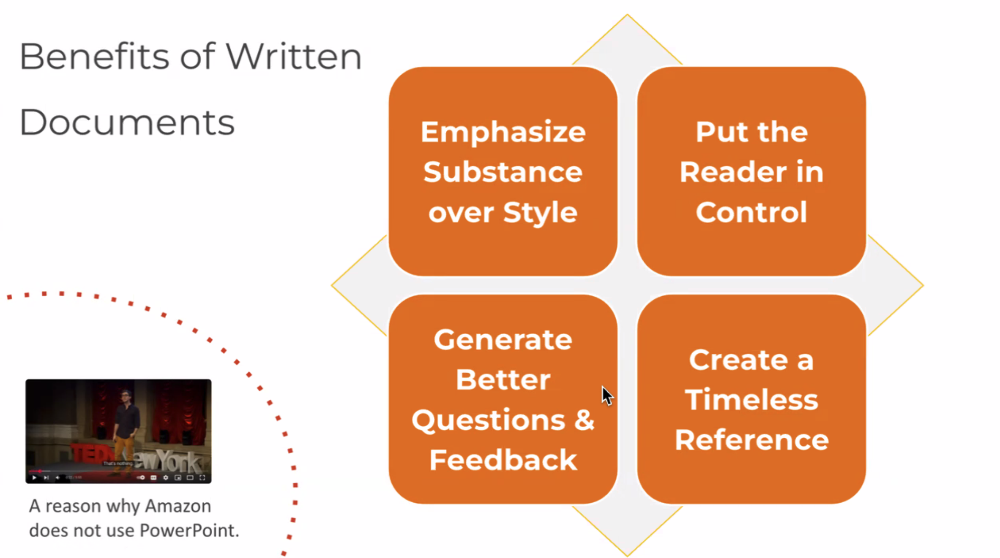
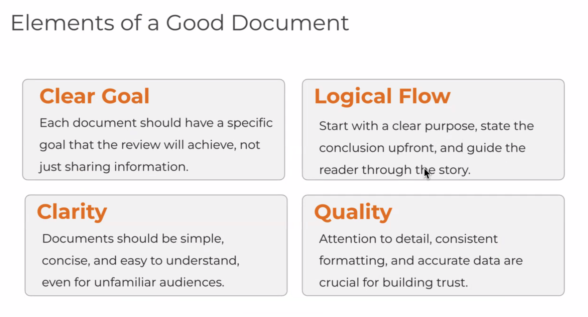
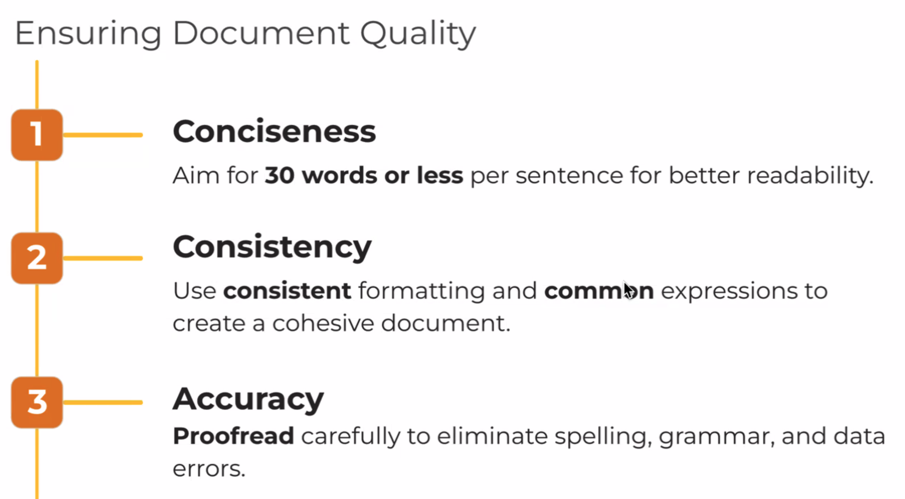
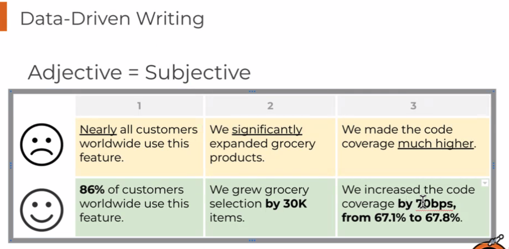

# Logical Thinking

## Mini Exercise
Hi Team,

I wanted to inform you that the project will require an additional week beyond our original timeline.

There were some factors that caused the delay:

- Scope Change: We received a specification change from our customer.
- Technical Challenges: We encountered difficulties in setting up the test environment.
- Resource Change: A-san has moved to another team. This has impacted our progress as we work to redistribute their responsibilities.

Current Status:

We are currently working to mitigate the impact and we are confident that we can get back on track by beginning of next month.

Actions:

- We will provide a more detailed revised schedule as soon as possible.
- We will hold a brief meeting every morning from today to sync up the changes and solve blockers if any.
- If anyone has suggestions or expertise related to environment setup, please reach out to me.

Feel free to reach out to me if you have any questions or concerns.

Thank you,

# Documentation

